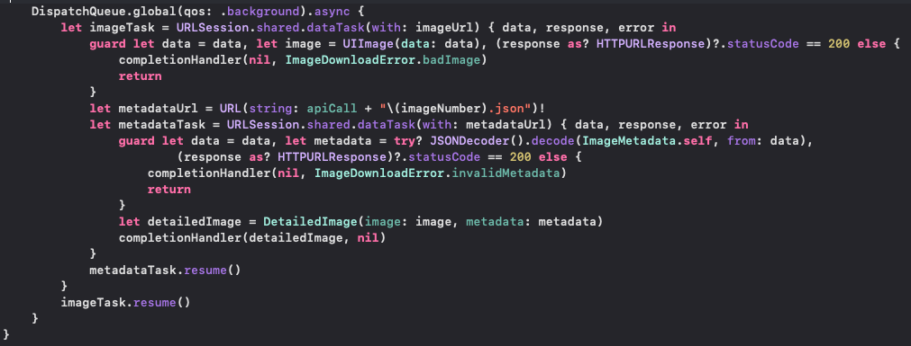

# AsyncAwaitQueue

## Project Module 3, Diplomado 5G

The purpose of this project is to show how to fetch an API call to download an image and it's metadata on a background thread.
The image below displays how to download the image using a background thread with DispatchQueue

Author  | Omar Orlando Ortega Moreno
------- | --------------------------
